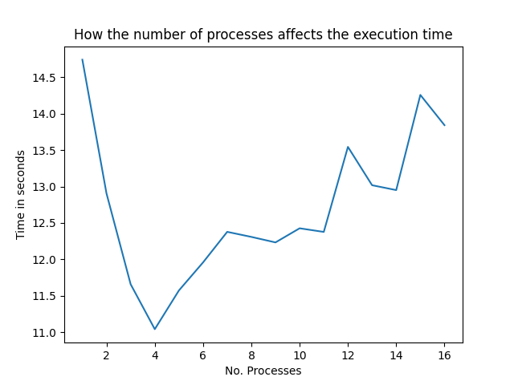
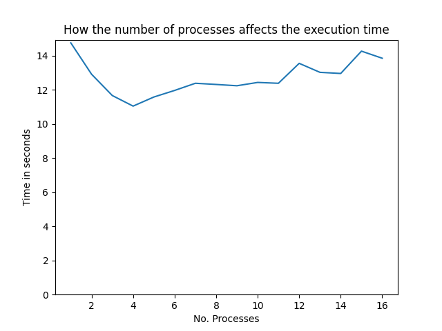

# EventBasedSystems

## About
Repository for the Event Based System FII course.

## To run program

* A **json** config file with the following format:
```json
{
    "publications": integer,
    "subscriptions": integer,
    "constraints": [
        {
            "type": {"frequency", "operator"},
            "field": {"stationid", "city", "temperature", "rain", "wind", "direction", "date"},
            "operator": {"<", "<=", ">=", ">", "=", "!="},
            "percent": "int in (0, 100)"
        }
    ],
    "threads": integer
}
```

Where:
* **publications** represents the number of publications to be generated. It is a positive integer.
* **subscriptions** represents the number of subscriptions to be generated. It is a positive integer.
* **constraints** is an array where:
    * **type** represents the type of constraint
        * *frequency* means that the constrained field needs to appear a certain amount of time
        * *operator* means that the from the generated subscriptions with that field, a certain amount need to have the specified operator
    * **field** represents the publication field that will constrained and takes values from the specified publication fields
    * **operator**
        * If the type is **frequency**, it will represent the ratio between the given percentage and the total amount of subscriptions
        * Otherwise, it will represent the type of operator that needs to appear in the constrained generated subscriptions
    * **percent** represents the percentage of subscriptions that the constrains will be applied on
* **threads**: represents an integer on the amount of threads to run the program


## Results
The program will output a *json* file named ***results.json*** which will contain the results of the program on the following format:
```json
{
    "publications": [list of publications],
    "subscriptions": [list of subscriptions]
}
```

And it will also create a ***[no.processes].txt*** containing the time in seconds it took to run and the number of processes it realized the task with.

## Time comparison

An experiment where the program generated 20000 publications and subcriptions was executed to test how the number of processes affected the performance.





We can observe that spreading the work between multiple processes is improving the execution time but a too great of an increase has diminishing returns for this experiment. This is easily seen as have a steep decline in execution time from 1 process to 4 followed by an increase in execution time that is still lower than the single process execution time.
